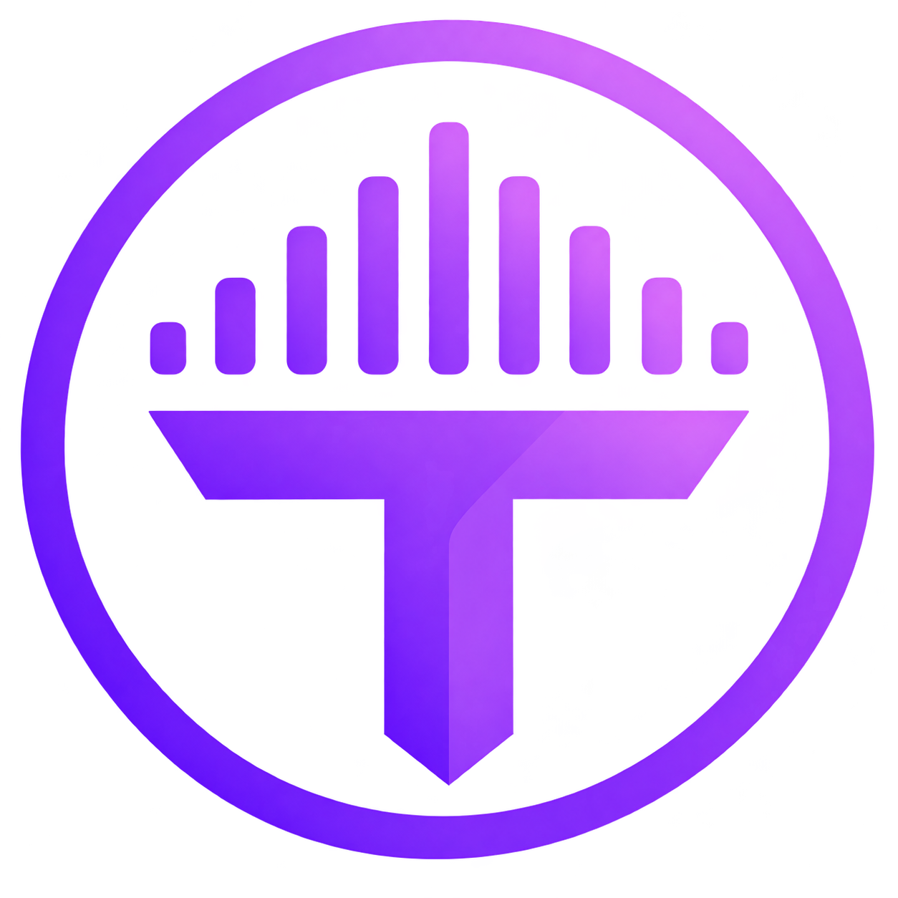
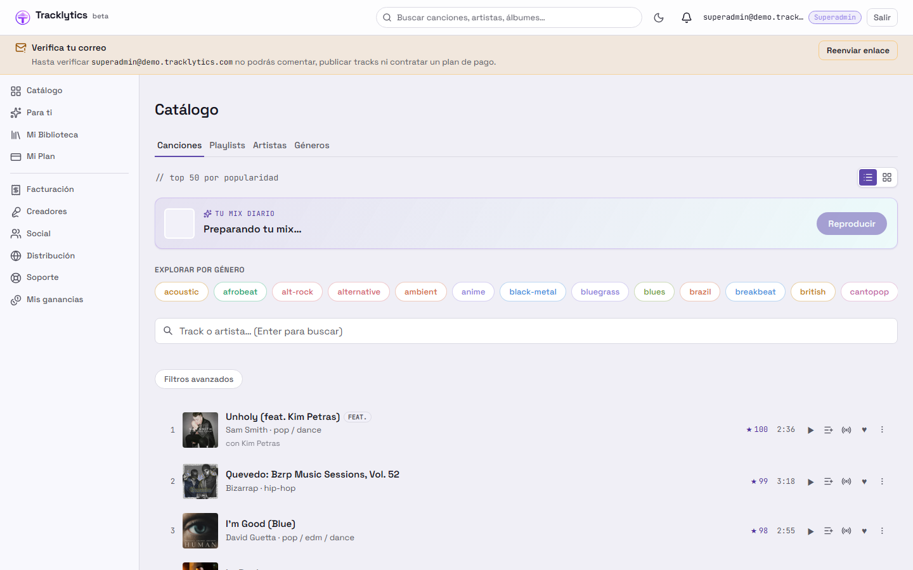
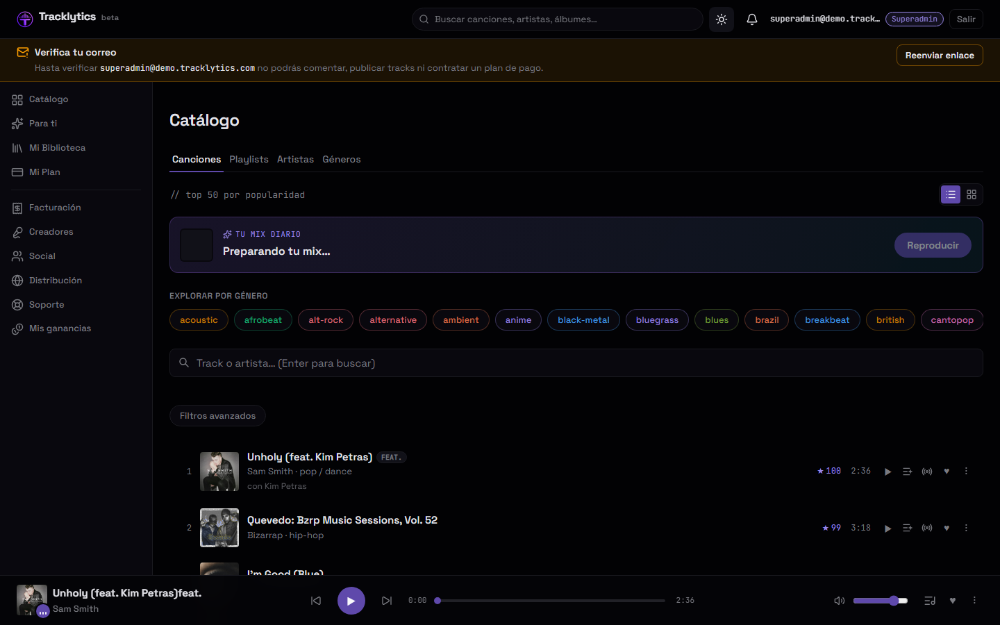
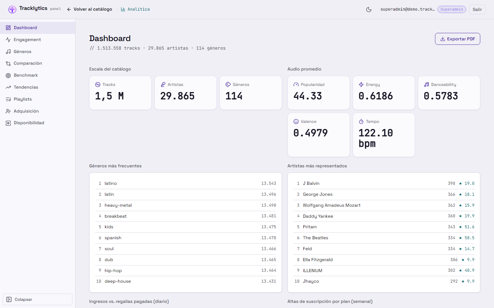
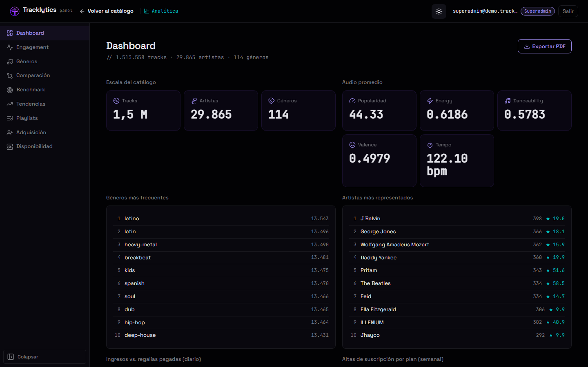
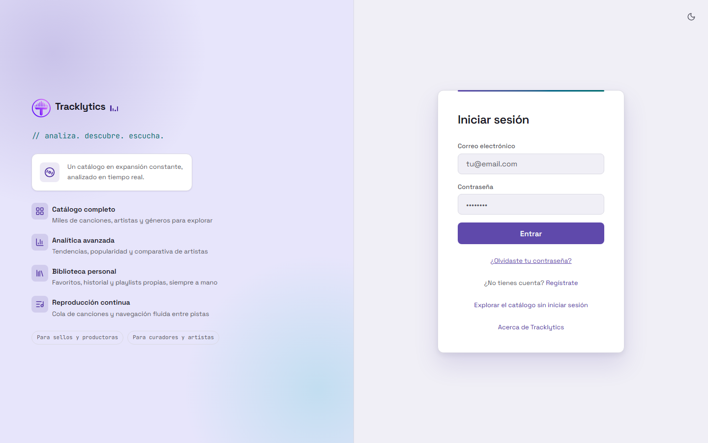
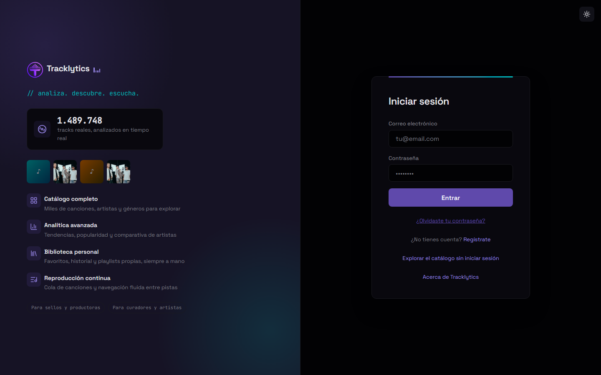

<div align="center">
  

  <h1>TRACKLYTICS</h1>
  <p><strong>Analítica musical e inteligencia de negocio sobre datos de Spotify</strong></p>

  <p>
    
    
    
    
  </p>

  <p>
    
    
    
    
    
    
    
    
    
  </p>
</div>

<br />

Tracklytics es una plataforma completa de streaming musical con un motor de
analítica e inteligencia de negocio propio: catálogo, reproducción real,
suscripciones, pagos, creadores, comunidad, distribución, regalías,
publicidad y finanzas conviven con dashboards ejecutivos y administrativos
sobre un modelo dimensional en ClickHouse.

Todo el sistema fue especificado con **Spec Driven Development** (15
capabilities de negocio, 100% especificadas y archivadas con
[OpenSpec](https://github.com/Fission-AI/OpenSpec)) antes de escribir código,
y construido de forma incremental a lo largo de 17 semanas de desarrollo.

<br />

<div align="center">

### Información académica

| | |
|---|---|
| **Institución** | Universidad Técnica Estatal de Quevedo |
| **Carrera** | Ingeniería en Software |
| **Asignatura** | Construcción del Software |
| **Estudiante** | Eduardo Reinoso Vélez |

</div>

---

## Capturas

<table>
  <tr>
    <td width="50%"></td>
    <td width="50%"></td>
  </tr>
  <tr>
    <td align="center"><sub>Catálogo — tema claro</sub></td>
    <td align="center"><sub>Catálogo — tema oscuro</sub></td>
  </tr>
  <tr>
    <td width="50%"></td>
    <td width="50%"></td>
  </tr>
  <tr>
    <td align="center"><sub>Dashboard analítico — tema claro</sub></td>
    <td align="center"><sub>Dashboard analítico — tema oscuro</sub></td>
  </tr>
  <tr>
    <td width="50%"></td>
    <td width="50%"></td>
  </tr>
  <tr>
    <td align="center"><sub>Inicio de sesión — tema claro</sub></td>
    <td align="center"><sub>Inicio de sesión — tema oscuro</sub></td>
  </tr>
</table>

---

## Qué incluye

- **Catálogo y biblioteca** — navegación por canciones/playlists/artistas/géneros, búsqueda
  avanzada, favoritos, playlists colaborativas, historial y reproducción de audio real
  (YouTube, con fallback simulado).
- **Monetización completa** — planes B2C/B2B, facturación, regalías con liquidación real por
  período, publicidad con CPM real y un panel financiero consolidado (gastos, cuentas por
  cobrar/pagar, presupuesto de campañas).
- **Creadores y comunidad** — cuentas de artista, subida de tracks, seguimiento, comentarios,
  feed de actividad y moderación.
- **Distribución** — sellos, licencias, restricción geográfica de reproducción y configuración
  de país/moneda/IVA.
- **Analítica de negocio** — dashboards ejecutivos, comparación y benchmark de artistas,
  tendencias, proyecciones estadísticas y un Balanced Scorecard estratégico, con acceso
  graduado por tier B2B (Básico / Pro / Enterprise).
- **Administración** — un panel por rol (seis roles administrativos por área) con auditoría,
  permisos, gestión de usuarios, moderación e ingesta de datos.
- **API de partners** — catálogo de solo lectura para integradores externos, autenticada por
  API key y segmentada por tier.

15 capabilities de negocio en total, todas especificadas, implementadas y verificadas
end-to-end. El detalle línea por línea de cada una vive en `openspec/specs/`.

---

## Stack tecnológico

| Capa | Tecnología |
|---|---|
| Frontend | React 18 + TypeScript + Vite, containerizado con Nginx |
| API | FastAPI (Python 3.11), un paquete por capability |
| Base de datos analítica | ClickHouse (modelo dimensional en esquema estrella) |
| Orquestación ETL | Apache Airflow |
| Autenticación y datos operativos | PocketBase |
| Visualización | Recharts |
| Infraestructura | Docker Compose |
| Metodología | Spec Driven Development ([OpenSpec](https://github.com/Fission-AI/OpenSpec)) |

---

## Puesta en marcha

```bash
git clone https://github.com/eduaardok/tracklytics.git
cd tracklytics
```

Crea un archivo `.env` en la raíz (ver `docker-compose.yml` para la lista completa de
variables) y levanta todo el stack:

```bash
docker compose up -d
```

En la primera ejecución, espera unos minutos a que `pb-init` cargue el dataset base antes de
disparar el ETL desde `/seguridad/ingesta` (rol `admin`). Para desarrollo del frontend con hot
reload:

```bash
cd frontend
npm install
npm run dev
```

---

## Documentación

La documentación técnica detallada vive en `docs/`:

- [`docs/BITACORA_RESUMEN.md`](docs/BITACORA_RESUMEN.md) — resumen semanal de todo el desarrollo (S6–S17).
- [`docs/DIMENSIONAL_MODEL.md`](docs/DIMENSIONAL_MODEL.md) — modelo dimensional completo.
- [`docs/CONSTITUCION_TRACKLYTICS.md`](docs/CONSTITUCION_TRACKLYTICS.md) — identidad y principios del proyecto.
- [`docs/OBJETIVOS_TRACKLYTICS.md`](docs/OBJETIVOS_TRACKLYTICS.md) — mapa de objetivos estratégicos y de trazabilidad.
- `openspec/specs/` — especificación formal de las 15 capabilities.

---

## Licencia

Distribuido bajo licencia [MIT](LICENSE).
